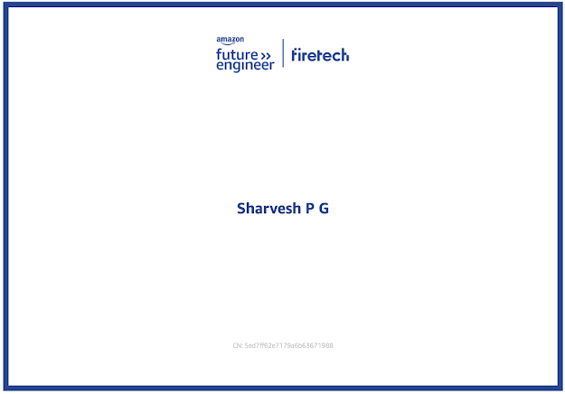

# 👋Hi, I am Sharvesh 

# About Me
I am a Computer Science student at PSG Tech, passionate about Cloud Computing and Generative AI. I enjoy exploring diverse domains such as Data Science and Full-Stack Development, and I actively participate in tech conferences, cycling events, and marathons. I am also pursuing the IIT-Madras BS Data Science program.
A passionate writer and blogger, I believe in continuous learning and creating solutions that have a lasting impact. I'm also a voracious reader, constantly seeking new perspectives and knowledge across disciplines.

# Interests
1. Ai
2. Cycling
3. Reading
4. Blogging
5. Online Gaming
6. Anime

# Achievements

	🌟 Blue Star Awards – Youth Icon of the Year:Honored for the book Treasured Droplets 
    

	🖋️ Magic Book of Records – Awarded for the book 5Cs of Mother India 
    
	
	💻 Amazon Future Engineer – Python Coding Program:Completed the Python Coding Program under Amazon Future Engineers
     

# Contact Info
  
📧 Email: Sharvesh.gp76@gmail.com 

🔗LinkedIn:https://www.linkedin.com/in/sharvesh-pg-545a81369/

🧑‍💻 GitHub: https://github.com/sharvesh-gp